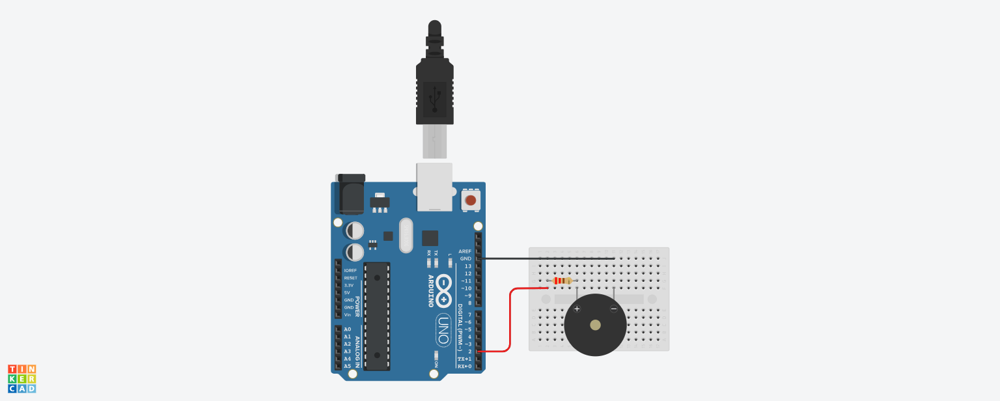

# Audio to Arduino Melody Converter

This project converts an MP3 audio file into a melody that can be played by an Arduino using a buzzer. It processes an MP3 file to extract pitches and durations, then generates Arduino-compatible arrays for melodies and note durations.

## Table of Contents

- [Audio to Arduino Melody Converter](#audio-to-arduino-melody-converter)
  - [Table of Contents](#table-of-contents)
  - [Features](#features)
  - [Prerequisites](#prerequisites)
  - [Installation](#installation)
  - [Usage](#usage)
  - [Hardware Setup](#hardware-setup)
    - [Components Needed](#components-needed)
    - [Circuit Diagram](#circuit-diagram)
    - [Connection Instructions](#connection-instructions)
  - [Sample Arduino Sketch](#sample-arduino-sketch)
  - [How It Works](#how-it-works)
  - [Limitations](#limitations)
  - [License](#license)

## Features

- Converts MP3 files into arrays of pitches and durations for Arduino.
- Extracts pitches using `librosa`'s `pyin` algorithm.
- Quantizes note durations based on a specified tempo.
- Generates Arduino arrays ready to be pasted into your sketch.

## Prerequisites

- Python 3.6 or higher
- An MP3 file containing monophonic melody (single notes, no chords)
- Arduino IDE for uploading sketches to your Arduino board
- A buzzer or speaker connected to your Arduino

## Installation

1. **Clone the Repository**

   ```bash
   git clone https://github.com/arashjafari/audio-to-arduino.git
   cd audio-to-arduino
   ```

2. **Install Python Dependencies**

   Ensure you have `pip` installed, then run:

   ```bash
   pip install -r requirements.txt
   ```

   **Requirements (`requirements.txt`):**

   ```
   pydub
   librosa
   numpy
   ```

   - **Note:** You may need additional system libraries for `librosa` and `pydub`. For example, `ffmpeg` is required for audio processing.

3. **Install FFmpeg**

   - **Windows:** Download from [FFmpeg Builds](https://www.gyan.dev/ffmpeg/builds/) and add it to your system PATH.
   - **macOS:** Install via Homebrew:

     ```bash
     brew install ffmpeg
     ```

   - **Linux (Debian/Ubuntu):**

     ```bash
     sudo apt-get install ffmpeg
     ```

## Usage

```bash
python audio_to_arduino.py <input_file.mp3> [options]
```

**Options:**

- `--tempo <tempo>`: Set the tempo in beats per minute (BPM). Default is `120`.

**Example:**

```bash
python audio_to_arduino.py melody.mp3 --tempo 100
```

After running the script, you will see output similar to:

```c
int melody[] = {
  NOTE_C4, NOTE_D4, NOTE_E4, // ... and so on
};

int durations[] = {
  4, 4, 2, // ... and so on
};
```

Copy these arrays into your Arduino sketch.


## Hardware Setup

To play the generated melody on your Arduino, you'll need to set up a simple circuit with a buzzer or speaker.

### Components Needed

- **Arduino Board** (e.g., Arduino Uno)
- **Piezo Buzzer** or small speaker
- **Connecting Wires**
- **Breadboard** (optional, but helpful for prototyping)

### Circuit Diagram



*Figure: Wiring diagram for connecting the buzzer to the Arduino.*

### Connection Instructions

1. **Buzzer/Speaker Connections:**
   - **Positive Lead (+):** Connect to **Digital Pin 2** on the Arduino (or the pin defined as `BUZZER_PIN` in your sketch).
   - **Negative Lead (-):** Connect to **Ground (GND)** on the Arduino.

2. **Arduino Connections:**
   - Ensure your Arduino is connected to your computer via USB for programming.
   - After uploading the sketch, you can power the Arduino via USB or an external power source.

**Note:** If using a small speaker instead of a piezo buzzer, you may need to include a resistor (e.g., 100Ω) in series to limit the current.


## Sample Arduino Sketch

Below is a sample Arduino sketch that uses the generated `melody` and `durations` arrays to play the melody through a buzzer.

```cpp
#include "pitches.h"

#define BUZZER_PIN 2

int melody[] = {
  // Paste your melody array here
};

int durations[] = {
  // Paste your durations array here
};

void setup() {
  pinMode(BUZZER_PIN, OUTPUT);
}

void loop() {
  PlayMusic(melody, durations, sizeof(melody) / sizeof(int));
  delay(5000); // Wait 5 seconds before replaying
}

void PlayMusic(int melody[], int durations[], int size) {
  for (int note = 0; note < size; note++) {
    int duration = 1000 / durations[note];
    tone(BUZZER_PIN, melody[note], duration);
    int pauseBetweenNotes = duration * 1.30;
    delay(pauseBetweenNotes);
    noTone(BUZZER_PIN);
  }
}
```

**Note:** You'll need the `pitches.h` file, which contains definitions for note frequencies. You can find it in the Arduino IDE examples or [download it online](https://www.arduino.cc/en/Tutorial/BuiltInExamples/toneMelody).

## How It Works

1. **Convert MP3 to WAV**

   The script first converts the input MP3 file to WAV format using `pydub`.

2. **Extract Pitches**

   It then uses `librosa`'s `pyin` algorithm to extract the fundamental frequencies (pitches) from the audio file.

3. **Map Frequencies to MIDI Notes**

   The frequencies are converted to MIDI note numbers, which are then mapped to Arduino note constants (e.g., `NOTE_C4`).

4. **Calculate Durations**

   Durations between notes are calculated based on the timestamps of the detected pitches.

5. **Quantize Durations**

   Durations are quantized to standard musical note lengths (whole, half, quarter, eighth, sixteenth) based on the specified tempo.

6. **Group Repeated Notes**

   Consecutive identical notes are grouped together, and their durations are summed to simplify the melody.

7. **Generate Arduino Arrays**

   Finally, the script prints out the `melody` and `durations` arrays in a format ready to be pasted into an Arduino sketch.

## Limitations

- **Monophonic Audio Only:** The script is designed for monophonic melodies (one note at a time). Polyphonic audio (chords, multiple instruments) will not produce accurate results.
- **Audio Quality:** The accuracy of pitch detection depends on the quality of the input audio. Noisy recordings may lead to incorrect pitches.
- **Unsupported Formats:** Currently, only MP3 files are supported. You can modify the script to handle other formats if needed.

## License

This project is licensed under the [MIT License](https://opensource.org/licenses/MIT).

Feel free to contribute to this project by submitting issues or pull requests.

---

**Disclaimer:** This tool is intended for educational purposes and personal projects. Always ensure you have the rights to use the audio files you process.